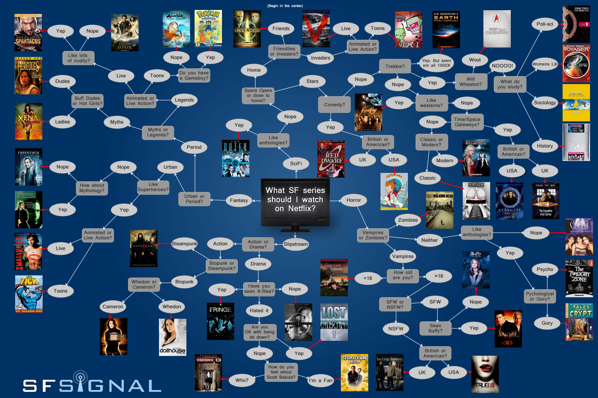

Projekt regułowego systemu eksperckiego do wyboru serialów

Wersja SDK/JDK: 23.0.1

Sposób uruchomienia aplikacji:
- wywołanie w folderze SI_projekt polecenia:
`java -jar tv-shows-expert-system.jar`

Autorzy:

Artur Strzelecki 155 294

Filip Baranowski 155 828
